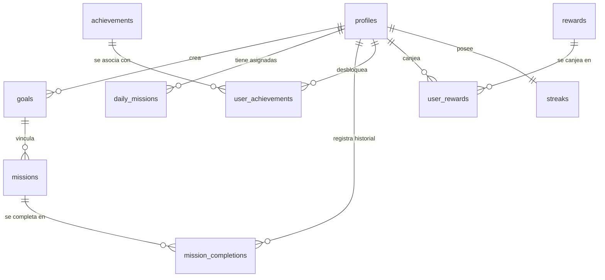

# MISIÓN — Modelo de Base de Datos y Seguridad (PostgreSQL / Supabase)

## 1. Esquema Relacional

---

## 2. Definición de Tablas

### `profiles`
- `id`: `UUID` (Primary Key, referencia a `auth.users.id`).
- `email`: `TEXT` NOT NULL.
- `full_name`: `TEXT` NOT NULL.
- `avatar_url`: `TEXT`.
- `total_impulso`: `INTEGER` DEFAULT 0 (Impulso acumulado para cálculo de nivel).
- `chispas`: `INTEGER` DEFAULT 0 (Saldo de moneda interna).
- `created_at`: `TIMESTAMPTZ` DEFAULT now().
- `updated_at`: `TIMESTAMPTZ` DEFAULT now().

### `goals`
- `id`: `UUID` PRIMARY KEY DEFAULT gen_random_uuid().
- `user_id`: `UUID` REFERENCES profiles(id) ON DELETE CASCADE.
- `title`: `TEXT` NOT NULL.
- `description`: `TEXT`.
- `category`: `TEXT` NOT NULL CHECK (category IN ('Mente', 'Cuerpo', 'Relaciones', 'Crecimiento', 'Finanzas', 'Creatividad', 'Experiencias', 'Bienestar')).
- `target_date`: `DATE`.
- `status`: `TEXT` DEFAULT 'active' CHECK (status IN ('active', 'completed', 'paused')).
- `progress`: `NUMERIC` DEFAULT 0.0 CHECK (progress >= 0.0 AND progress <= 100.0).
- `icon`: `TEXT` DEFAULT 'flag'.
- `color`: `TEXT` DEFAULT '#3A7D63'.
- `created_at`: `TIMESTAMPTZ` DEFAULT now().

### `missions`
- `id`: `UUID` PRIMARY KEY DEFAULT gen_random_uuid().
- `title`: `TEXT` NOT NULL.
- `description`: `TEXT`.
- `category`: `TEXT` NOT NULL.
- `difficulty`: `TEXT` NOT NULL CHECK (difficulty IN ('Fácil', 'Normal', 'Difícil', 'Épica')).
- `duration_minutes`: `INTEGER` DEFAULT 15.
- `impulso_reward`: `INTEGER` NOT NULL,
- `chispas_reward`: `INTEGER` NOT NULL,
- `is_system_template`: `BOOLEAN` DEFAULT true.
- `created_at`: `TIMESTAMPTZ` DEFAULT now().

### `mission_completions` (Historial Inmutable)
- `id`: `UUID` PRIMARY KEY DEFAULT gen_random_uuid().
- `user_id`: `UUID` REFERENCES profiles(id) ON DELETE CASCADE.
- `mission_id`: `UUID` REFERENCES missions(id) ON DELETE CASCADE.
- `goal_id`: `UUID` REFERENCES goals(id) ON DELETE SET NULL.
- `completed_at`: `TIMESTAMPTZ` DEFAULT now().
- `impulso_earned`: `INTEGER` NOT NULL.
- `chispas_earned`: `INTEGER` NOT NULL.
- `notes`: `TEXT`.

### `streaks`
- `id`: `UUID` PRIMARY KEY DEFAULT gen_random_uuid().
- `user_id`: `UUID` UNIQUE REFERENCES profiles(id) ON DELETE CASCADE.
- `current_streak`: `INTEGER` DEFAULT 1.
- `best_streak`: `INTEGER` DEFAULT 1.
- `last_active_date`: `DATE` DEFAULT CURRENT_DATE.
- `freezes_available`: `INTEGER` DEFAULT 1.
- `updated_at`: `TIMESTAMPTZ` DEFAULT now().

### `achievements`
- `id`: `UUID` PRIMARY KEY DEFAULT gen_random_uuid().
- `code`: `TEXT` UNIQUE NOT NULL.
- `title`: `TEXT` NOT NULL.
- `description`: `TEXT` NOT NULL.
- `category`: `TEXT` NOT NULL.
- `icon`: `TEXT` NOT NULL.
- `condition_type`: `TEXT` NOT NULL.
- `condition_value`: `INTEGER` NOT NULL.
- `reward_chispas`: `INTEGER` DEFAULT 10.

### `user_achievements`
- `id`: `UUID` PRIMARY KEY DEFAULT gen_random_uuid().
- `user_id`: `UUID` REFERENCES profiles(id) ON DELETE CASCADE.
- `achievement_id`: `UUID` REFERENCES achievements(id) ON DELETE CASCADE.
- `unlocked_at`: `TIMESTAMPTZ` DEFAULT now().
- UNIQUE(user_id, achievement_id).

---

## 3. Seguridad y Row Level Security (RLS)
- Toda tabla vinculada a un usuario tiene habilitado `ALTER TABLE <table> ENABLE ROW LEVEL SECURITY;`.
- Política `SELECT / INSERT / UPDATE / DELETE` con `auth.uid() = user_id`.
- Las tablas públicas de catálogo (`missions`, `achievements`, `rewards`) tienen políticas de sólo lectura `SELECT` para usuarios autenticados.
- Las funciones SQL seguras (Stored Procedures / Triggers) administran la adición de saldo e historial para evitar manipulación del cliente.
